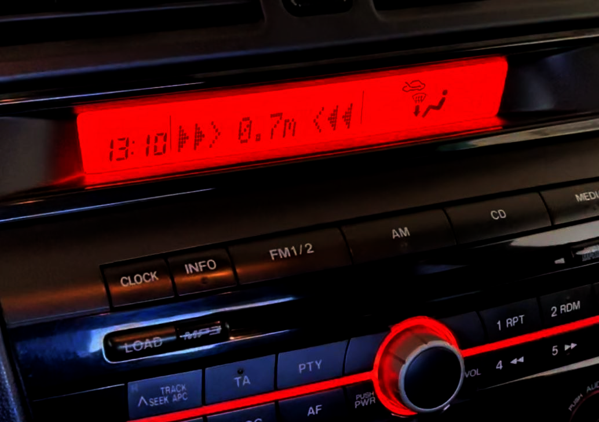

# Mazda Display Parktronic
The Mazda Display Parktronic is a device for capturing and decoding distance from third-party parking sensors and displaying it on standard Mazda 3/5/6 informational display.

The device captures MS CAN bus data, changes it and send to the Mazda's informational display.
Since the device is work with CAN bus, it can be used only in restyling car models (e.g Mazda 3 from 03.2006). This is due to the fact that in pre-styling models informational display is driven by audio head unit throught something like parallel interface (probably) and it's not supported (most like never be).

The Mazda Display Parktronic for now supports only one parking system - Falcon2616 4-Sensor.
But another 4-Sensor parktronics may also work, due to the same IC/Firmware base inside.

In the near future it is planned to implement support for 8-sensor parking systems.

 ##### Changelog:
Oct 5, 2021: v0.1a
  - Implemented Mazda Display Parktronic application.
  - Support for Falcon2616 4-Sensor parking system.

Sep 23, 2022: v0.2b
  - Fixed bug with display data flickering when parktronic is on.
  - Check parktronic state by tracking reverse gear bit in CAN status packet.
    Thus, increased the speed of data appearing on the display.
  - Added error message if there is no signal from parking system.
  - Added specific LED blinking when error occures (series of two short blinks).
  - Use CAN bypass circuit only in initial and error states.
  - Added option to override boring car greetings like 'Hello' or 'BOSE AUDIO'.
